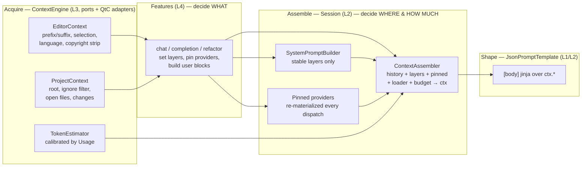

# QodeAssist — Context Architecture (v1.0)

Status: design proposal, extends `target-architecture.md` (§7 ContextEngine,
delta #9) and `agent-templates-design.md` (the `ctx.*` template contract).
Scope: everything between "facts exist in the IDE / on disk / in the
conversation" and "bytes leave in the request body" — what context each
pipeline needs, who acquires it, where it lands in the prompt. One assembly
runs per `send()`; tool continuations stay inside LLMQore (§4.3).

---

## 1. Taxonomy — the five kinds of context

Every piece of context the model ever sees falls into one of five categories.
The categories differ in *acquisition mode*, *volatility*, and therefore
*placement* — conflating them is the root cause of today's problems (§3).

| # | Category | What it answers | Examples | Volatility |
|---|----------|-----------------|----------|------------|
| C1 | **Identity** | who is the assistant | agent `system_prompt` (persona inline or via `read_file()`), always-on skills, skills catalog | per agent change |
| C2 | **Environment** | where is it working | project name + source root, build dir, language/file info, recent changes | per project / slow |
| C3 | **Task** | what is asked *now* | chat message, attachments, images, invoked-skill body, completion prefix/suffix, refactor selection + instruction | every turn |
| C4 | **Conversation** | what happened so far | history (text, thinking, tool use/results), compression summary | grows every turn |
| C5 | **Pulled** | what the model asked for | tool results (read file, search, build, diagnostics), MCP tool results | inside the turn |

Two acquisition modes cut across the categories:

- **Push** — we inject proactively (C1–C3, C4). Push is a *per-pipeline
  policy*: completion must push everything (no latency budget for tools);
  chat should push little and let the model pull.
- **Pull** — the model requests through tools (C5). Pull needs no assembly
  policy at all, but its *results* become C4 and therefore must flow through
  the same budget and serialization rules as everything else.

One more orthogonal property drives placement: **stability**. Provider prompt
caches (Claude `cache_control`) reward byte-stable prefixes. Stable content
belongs early (system), volatile content belongs late (near the last user
message). This single rule decides almost every placement question below.

---

## 2. Context inventory per pipeline

What each use case (numbering from `target-architecture.md` §1) actually
needs, against the taxonomy:

| Context item | Cat | U1 completion | U2 chat | U3 refactor | compression | Source port |
|---|---|---|---|---|---|---|
| agent `system_prompt` (persona) | C1 | ✓ | ✓ (persona switch = agent switch) | ✓ | ✓ | AgentProfile + ContextRenderer |
| skills catalog + always-on | C1 | — | ✓ | — | — | SkillsEngine |
| project root / build dir | C2 | — | ✓ | — | — | `IProjectScanner` |
| language + file info | C2 | ✓ | — | ✓ | — | `IDocumentReader` |
| recent project changes | C2 | optional (setting) | — | optional | — | ChangesManager |
| prefix / suffix (FIM) | C3 | ✓ | — | — | — | `IDocumentReader` |
| selection + position markers | C3 | — | — | ✓ | — | `IDocumentReader` |
| user message text | C3 | — | ✓ | ✓ (instruction) | ✓ (directive) | UI |
| attachments / images | C3 | — | ✓ | — | — | chat storage (loader) |
| invoked skill body (`/cmd`) | C3 | — | ✓ | — | — | SkillsEngine |
| linked files (pinned) | C3/C2 | — | ✓ | — | — | `IProjectScanner` + fs |
| open-files sync | C3/C2 | — | ✓ | — | — | `IProjectScanner` |
| history | C4 | — (fresh session) | ✓ | — (fresh) | ✓ (read-only input) | ConversationHistory |
| tool results | C5 | — | ✓ | ✓ (optional) | — | ToolsManager / McpHub |

---

## 3. Problems in the current code this design removes

1. ~~**Two assembly paths.**~~ — RECLASSIFIED 2026-06-12 as by-design, not a
   problem: the first request renders from `ConversationHistory`; tool
   continuations are LLMQore's replay of that payload plus appended tool
   results. The replay carries the full filtered history of its base payload,
   so the feared filter divergence does not materialize in practice (§4.3).
2. **No budget.** History is never trimmed, estimated, or compacted; every
   send ships everything, forever.
3. **Volatile content in system.** Linked-file contents live in the
   `chat.context` system layer; any file edit between turns invalidates the
   provider prompt cache for the whole request.
4. **Invoked skills evaporate.** A `/skill` body is injected into the system
   layer for one send only — the next turn the model has lost the skill's
   instructions, although the conversation continues to rely on them.
5. **Silent loss.** A failed attachment load drops the block with no trace —
   neither the model nor the user learns the image is gone.
6. **Repeated materialization.** Every send re-reads and re-base64s every
   stored image/attachment of the whole history from disk.
7. **Placement decided ad hoc.** Each feature hand-formats markdown and picks
   a system layer by habit (`completion.context`, `refactor`, `chat.context`);
   there is no shared rule for what goes where, and the project-info block is
   formatted three different ways.

---

## 4. Architecture — Acquire → Assemble → Shape

Three stages with hard ownership boundaries:



- **Acquire (L3)** — `ContextEngine` services behind IDE-agnostic ports read
  facts from the IDE/fs. No prompt text, no placement decisions. One shared
  `EnvBlockFormatter` renders the project/file info block so it is identical
  in every pipeline.
- **Features (L4)** decide *what* context a turn needs: they set their system
  layer, pin refreshable providers, and compose user blocks. They never
  decide request shape and never concatenate history.
- **Assemble (L2)** — `ContextAssembler` (successor of
  `Session::toLegacyContext`) is the **only** producer of the template
  context, once per `send()` dispatch; tool continuations replay that payload
  inside LLMQore (§4.3). It owns placement policy, budget enforcement,
  materialization, and the manifest.
- **Shape (L1)** — the agent's `[body]` table renders `ctx.*` into the wire
  request. Templates own *shape per provider*, never content.

### 4.1 The three injection mechanisms

| Mechanism | For | Lifetime | Refresh | Persisted |
|---|---|---|---|---|
| **System layers** (`SystemPromptBuilder`) | stable C1/C2: `agent.system`, `env.project`, `skills.catalog`, `refactor`, `compression` | conversation | on send | no |
| **Pinned providers** (new) | refreshable C3/C2: linked files, open-files sync | until unpinned | **every `send()`** | as reference only |
| **User blocks** (`send(blocks)`) | one-shot C3: message, attachments, images, invoked-skill body, completion content | that turn | never (history is immutable) | yes |

Pinned providers are the new piece:

```
session->pinContext(id, [](){ return materialized blocks; });
session->unpinContext(id);
```

The assembler calls every pinned provider at **every `send()`** and splices
the result as text blocks
**prepended to the turn's typed user message** — the last user-role wire
message that does not carry tool results (falling back to the tool-result
carrier, after its leading `tool_result` blocks, and to a synthetic user
message when the history has no user message at all). Prepending into an
existing message rather than inserting a separate one keeps strict
user/assistant alternation, which some provider APIs enforce.

The fixed anchor and the per-turn refresh split the cache cost fairly:
within a turn's tool loop the pinned blocks are byte-identical (continuations
replay the payload — pure appends, cache hits); the next `send()` re-reads
the files, and a change invalidates the cache only from the turn's anchor,
not from the system prefix. The materialized block's label states its capture
time ("content as of this turn") because a tool may mutate the file mid-loop;
the model sees such changes through the tool results themselves. Pinned
content is never stored in history and never persisted — never duplicated
turn-over-turn.

Invoked-skill bodies move the opposite way: out of the system layer into the
**user blocks of that turn** (a dedicated block type), so they persist in
history and survive the rest of the conversation (fixes problem 4).

### 4.2 Placement policy (single table, owned by the assembler)

| Content | Position in request | Why |
|---|---|---|
| `agent.system` (rendered TOML `system_prompt`) | system, first | static per agent → max cache reuse |
| `env.project`, `skills.catalog` | system, after agent | changes rarely |
| pipeline layers (`refactor`, `compression`, `completion.context`) | system, last | fresh session each time, ordering irrelevant |
| history | messages | as is |
| pinned materializations | text blocks prepended to the turn's typed user message, live content | fixed anchor keeps the prefix cache-stable; content refreshes because tools mutate files at any moment |
| task blocks | last user message | the turn itself |

`ClaudeCacheControl` breakpoints stay as they are (system / history tail);
this ordering is what makes them effective.

### 4.3 Tool continuations stay in LLMQore (replay)

The tool loop deliberately stays in LLMQore — the library is a complete,
standalone agentic client, and the loop (execute tools, count rounds,
schedule the next request, stream) is *mechanism*, which per
`target-architecture.md` design principle 3 belongs in C++ identically for
all providers. Continuation *content* is the library's default replay: the
base payload plus the assistant message and appended tool results.

An inversion hook (`setContinuationPayloadBuilder`, an optional per-request
callback letting `Session` re-assemble each continuation through
`ContextAssembler`) was implemented and **reverted 2026-06-12**: the problem
it solved was judged contrived. The replay already carries the full filtered
history of its base payload, mid-loop file changes reach the model through
the tool results themselves, and continuation growth within one turn is
bounded by `maxToolContinuations` — budget enforcement at `send()` time
covers the realistic cases. Consequences accepted with the revert: the
manifest logs one entry per `send()` (not per wire request), and pinned
content is byte-stable for the duration of a turn's tool loop (§4.1).

2026-06-13 the loop's *shape* inside LLMQore was refactored without changing
this decision (see `tool-loop-runner-plan.md`): the loop policy now lives in
`ToolLoopRunner` (per-request round state, limit, continuation decision) and
`BaseClient` slimmed to transport + tool dispatch with public primitives
`continueRequest` / `buildReplayContinuation` / `abortRequest`. Continuation
content is still the replay. QodeAssist sets the round limit via
`client->toolLoop()->setMaxRounds(...)`; the old `setMaxToolContinuations`
stays as a forwarder for compatibility.

### 4.4 Budget

`ContextAssembler` consults a `BudgetPolicy` before producing the context:

```
input_estimate = TokenEstimator(system + history + pinned + task)
limit          = agent context_window − body.max_tokens (output reserve)
```

`context_window` comes from provider/model metadata with an optional agent
TOML override. When the estimate exceeds the limit the policy returns a trim
plan executed in deterministic order:

1. elide bodies of tool results older than the last N rounds
   (`[tool result elided — N tokens]` placeholder, pairing preserved);
2. elide materializations of old stored images/attachments (placeholder
   block, reference kept in history);
3. below a hard floor — refuse with `ErrorCategory::Validation` and surface
   "compress the conversation" (ChatCompressor) in the UI.

v1.0 ships stages: **estimate + manifest + UI warning** first (no silent
trimming), then stage 1–2 elision, then auto-compression hooks. The
architecture fixes the *seam*; the policy can stay minimal.

`TokenEstimator` is calibrated per provider/model from `Usage` events
(§8.5 of the target architecture) — chars-per-token ratio updated after every
response; the chat token counter and the budget share this one estimator.

### 4.5 Materialization and caching

Stored content (attachments, images) stays reference-only in history;
materialization happens in the assembler through the `ContentLoader`. Two
fixes over today:

- the loader result is cached per `(storedPath, mtime, size)` — no re-reading
  the whole conversation's binaries on every send, and byte-identical turns
  keep the provider prompt cache warm;
- a failed load produces an **explicit placeholder block**
  (`[attachment unavailable: name.png]`) instead of silently vanishing —
  the model can say so, the manifest records it (fixes problem 5).

### 4.6 Observability: the context manifest

Every `assemble()` emits one debug-category log entry and a struct on the
event stream:

```
manifest {
  layers:   { agent.system: ~1.9k tok, env.project: ~70, skills.catalog: ~640 }
  history:  26 messages, ~14.2k tok (3 tool rounds)
  pinned:   { linked:src/main.cpp: ~2.1k }
  task:     ~310 tok, 1 image (cached)
  elided:   [ tool_result a4f1 (~8k) ]
  estimate: ~19.3k / limit 32k
}
```

Nothing is dropped silently — every filter (unsigned thinking, orphaned tool
pairs, failed loads, budget elisions) leaves a manifest record. The token
counter UI reads the same struct.

---

## 5. Wire contract — `ctx.*` stays, gains one producer

`Templates::ContextData` (→ `ctx.system_prompt`, `ctx.history`,
`ctx.prefix/suffix`, `ctx.files_metadata`) remains the contract between the
core and `[body]` templates — it is not legacy, it is the template-facing
view of the assembled context. The change is that exactly one function
produces it (`ContextAssembler::assemble`), for every request, and
`toLegacyContext`/`buildLegacyContext` are renamed into it. Existing
serialization rules carry over unchanged: system messages never enter
history, unsigned thinking is dropped, orphaned tool_use/tool_result pairs
are filtered, `CompletionContent` becomes `prefix`/`suffix`.

---

## 6. Migration plan

Ordered so every step lands independently and shrinks risk:

1. **Extract `ContextAssembler`** from `buildLegacyContext` (pure, unit-tested
   against fixture histories) + manifest logging + failed-load placeholder
   blocks. No behavior change otherwise. — DONE 2026-06-12
   (`sources/Session/ContextAssembler.{hpp,cpp}`, `test/ContextAssemblerTest.cpp`;
   manifest logged under the `qodeassist.context` category).
2. **ContentLoader cache** keyed by `(path, mtime, size)`. — DONE 2026-06-12
   (`StoredContentCache` in `ChatSerializer`, owned per-chat by
   `ClientInterface`, cleared on chat switch).
3. **Pinned providers**: linked files and open-files sync move out of the
   `chat.context` system layer; invoked-skill bodies move into the turn's
   user blocks. `chat.context` shrinks to project info + skills catalog.
   — DONE 2026-06-12 (`Session::pinContext/unpinContext`, pinned splice in
   `ContextAssembler::assemble`; `SkillInvocationContent` block persisted via
   `MessageSerializer`, invisible in the chat UI by design; open-files sync is
   covered because `ChatRootView` merges open editors into the linked list).
4. **Shared `EnvBlockFormatter`** in ContextEngine; chat/refactor/completion
   stop hand-formatting project/file info. — DONE 2026-06-12
   (`context/EnvBlockFormatter.{hpp,cpp}`: pure `formatProject`/`formatFile`
   + the `currentProject()` QtC gatherer; chat project block, refactor file
   header, and completion's `getLanguageAndFileInfo` all route through it).
5. ~~**Continuation payload callback**~~ — REVERTED 2026-06-12 (implemented,
   then judged a solution to a contrived problem; see §4.3). Continuations
   are LLMQore's default replay; `ContextAssembler` runs once per `send()`.
6. **TokenEstimator + BudgetPolicy seam** — estimate + warning first, then
   elision stages.
7. **ContextEngine port split** (delta #9 of the target architecture) —
   `EditorContext` / `ProjectContext` / `TokenEstimator` behind ports, QtC
   API only in `ide/context` adapters.

---

## 7. Open questions

1. ~~**Pinned placement**~~ — RESOLVED 2026-06-12: text blocks prepended to
   the last user-role wire message (synthetic user message only when there is
   none). A separate synthetic message would break strict role alternation on
   some provider APIs; cache behaviour of the two shapes is identical.
2. ~~**Tool-loop relocation cost**~~ — RESOLVED 2026-06-12: relocation
   rejected (LLMQore is deliberately a standalone agentic client). The
   follow-up `setContinuationPayloadBuilder` inversion hook was also
   implemented and reverted the same day — replay is the accepted behaviour
   (§4.3).
3. **Budget v1 scope** — warn-only vs. enabling tool-result elision
   immediately. Elision changes what the model sees; needs live validation.
4. **Completion and open files** — should completion gain pinned open-files
   context (cheap with this design), or stay prefix/suffix-only for latency?
