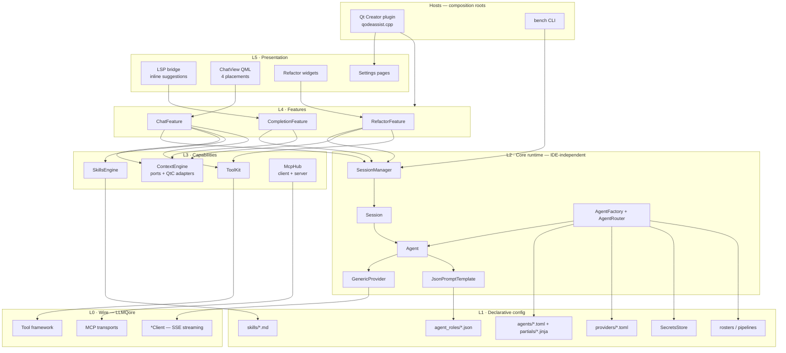
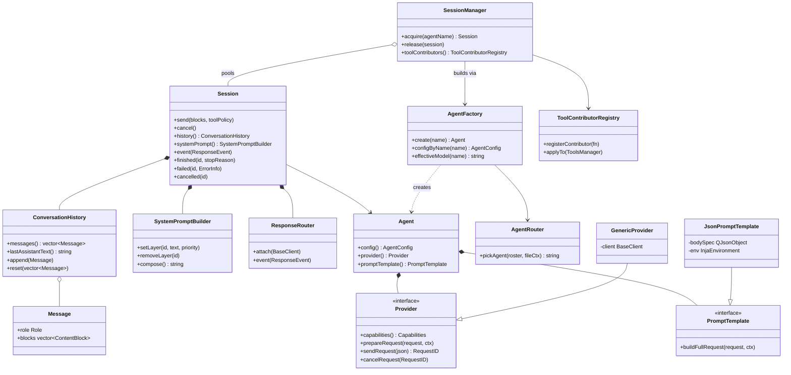
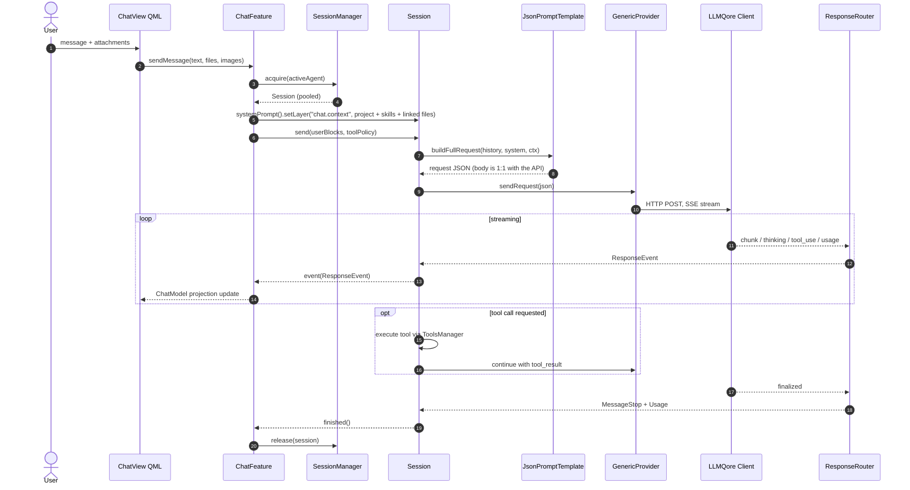
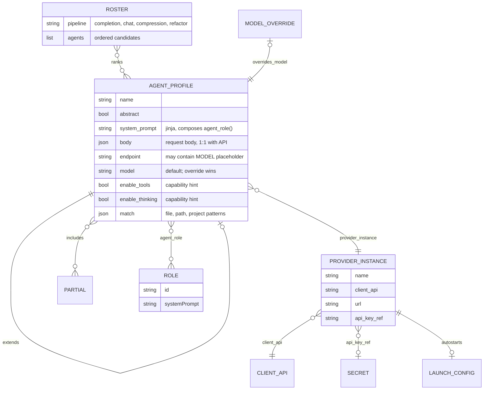

# QodeAssist — Target Architecture (v1.0)

Status: design baseline, derived from the fixed use-case inventory below.
Scope: the complete plugin, designed "from scratch" — what the architecture
should be if nothing legacy constrained it. The current code (see
`architecture.md`) already converges on this; §10 lists the remaining deltas.

---

## 1. Use-case inventory (requirements baseline)

Every architectural decision below is justified by one of these. Features not
on this list (Rules system, legacy provider/model/template pickers, Stack A)
are intentionally out of scope.

| # | Use case | What the user gets |
|---|----------|--------------------|
| U1 | **Code completion** | Inline FIM/instruct suggestions via LSP; auto + manual trigger, multiline, smart-context suppression, accept full / word-by-word |
| U2 | **Chat assistant** | 4 placements (sidebar, bottom pane, editor tab, floating window); streaming text + thinking blocks + tool blocks + file-edit blocks (apply/undo); attachments, linked files, @-mentions, open-files sync; token counter; persisted history; one-click summarization; runtime agent + role pickers |
| U3 | **Quick refactor** | Selection + instruction by hotkey; custom-instructions library; separate agent; optional tools; streamed result inserted into the editor |
| U4 | **Tools** | read/create/edit file, search, find, list, build, diagnostics, terminal, todo, load_skill; per-tool enable |
| U5 | **Skills** | discovery from `.qodeassist/skills`, `.claude/skills`, `~/.claude/skills`; auto-injection, explicit `/` picker, always-on |
| U6 | **MCP** | server mode (expose plugin tools, HTTP/SSE + stdio bridge) and client hub (consume external tools in chat/refactor) |
| U7 | **Providers** | 13 `client_api` types over one GenericProvider; secrets store; local-server autostart; model listing |
| U8 | **Agents** | TOML profiles: `extends`, `[body]` table 1:1 with the wire request, Jinja partials, `match` rules, per-agent model override, per-pipeline rosters |
| U9 | **Roles** | JSON roles composed into `system_prompt` via `{{ agent_role(id) }}` |
| U10 | **Bench CLI** | headless agent testing on the same core stack, `.env` secrets |
| U11 | **Configuration UI** | settings pages for everything above; per-project settings; updater + status widget |

---

## 2. Design principles

1. **One stack.** Every LLM byte — completion, chat, compression, refactor,
   bench — flows through the same `Session` pipeline. No parallel legacy path.
2. **Hexagonal core.** The runtime (agents, sessions, providers, templates,
   prompt rendering) has zero Qt Creator dependencies. The IDE and the bench
   CLI are two hosts composing the same core; IDE-specific facts enter only
   through ports (document reading, project scanning, secrets, tool hosting).
3. **Configuration is declarative, code is mechanism.** What is sent (request
   `[body]`, system prompt, endpoint, model) lives in TOML/JSON/Jinja and is
   user-overridable; *how* it is sent (streaming, retries, tool loop, event
   routing) lives in C++ and is identical for all providers.
4. **Capability-driven behavior.** Providers and agents declare capabilities
   (tools, thinking, images, model listing); features and UI adapt to the
   declared set instead of switching on provider names.
5. **Single source of truth for conversation state.** `ConversationHistory`
   owns the messages; `ChatModel` and persistence are projections of it, never
   independent copies.
6. **Per-feature composition roots, no singletons.** Each feature constructs
   and owns its dependencies (`new` + parent); shared services are passed
   explicitly (constructor/setter, QML context properties for the chat).
7. **Streaming-first event model.** One typed `ResponseEvent` stream is the
   only contract between the core and every consumer. Deltas exist for live
   UI (chat); one-shot pipelines (completion, refactor, bench) ignore them,
   wait for `finished`, and read the final assistant message from history.
8. **Fail at load, not mid-conversation.** Agent profiles are validated when
   loaded (partials resolve, assembled body parses as JSON against a synthetic
   context), so a config error never surfaces as a silent runtime drop.

---

## 3. Layered model



### Layer contracts

| Layer | Contains | May depend on | Must NOT depend on |
|-------|----------|---------------|--------------------|
| **L0 Wire** | LLMQore clients (one per wire protocol: Claude, OpenAI Chat, OpenAI Responses, Google, Ollama, Mistral, llama.cpp), tool framework, MCP transports | Qt Network | anything above |
| **L1 Config** | `ProviderInstance`, `AgentProfile` (+ loader/validator), rosters, roles, skills, secrets port | toml++, inja | Qt Creator, L2+ |
| **L2 Core** | `Agent`, `AgentFactory`, `AgentRouter`, `Provider`/`GenericProvider`, `JsonPromptTemplate`, `Session`, `SessionManager`, `ConversationHistory`, `SystemPromptBuilder`, `ResponseRouter`, `ToolContributorRegistry` | L0, L1 | Qt Creator, QML, features |
| **L3 Capabilities** | `ContextEngine` (ports + QtC adapters), `ToolKit` (built-in tools), `SkillsEngine`, `McpHub` | L0–L2, QtC APIs *only in adapters* | features, UI |
| **L4 Features** | `CompletionFeature`, `ChatFeature` (send/stream, compression, token counting, file edits), `RefactorFeature` | L2, L3 | each other |
| **L5 Presentation** | LSP bridge, ChatView QML, refactor widgets, settings pages | its feature | core internals |
| **Hosts** | plugin shell, bench CLI | everything (composition only) | — |

The hard rule that makes U10 (bench) and testability free: **L0–L2 build into
targets with no Qt Creator linkage.** Bench links L0–L2 plus a thin CLI host;
the plugin adds L3 adapters, L4, L5.

---

## 4. Core domain model

Rendered copy: [core-class-diagram.svg](core-class-diagram.svg) (regenerate
when the diagram below changes).



Responsibilities, one line each:

- **Agent** — immutable bundle of *what to call*: resolved config + provider +
  compiled prompt template. No request state.
- **Session** — one conversation's runtime: owns history, system-prompt
  layers, response routing, the in-flight request, and the tool-execution
  loop (tool_use → execute → tool_result → continue). `send(blocks)` is the
  *only* entry point: every pipeline appends a user message and dispatches;
  there are no per-pipeline send variants. What differs between completion,
  chat, and refactor is the agent's template and the consumption mode (deltas
  vs final message), never the Session API.
- **SessionManager** — creates/pools sessions per agent; the single place
  features go to get one. Pooling (not per-message construction) covers the
  "fresh agent + provider + secrets read per request" latency cost. It reuses
  only the expensive parts (agent, provider, compiled template, secrets read):
  `acquire` hands out a session with cleared history and system-prompt
  layers, so one-shot pipelines never see a previous exchange.
- **AgentRouter** — the *only* agent picker. Every pipeline (completion, chat,
  compression, refactor) resolves its agent through
  `pickAgent(roster, {file, project})`; no feature-local picker logic.
- **GenericProvider** — one class for all 13 client APIs; varies only by
  LLMQore client factory + metadata. Request *shape* belongs to the template,
  never to the provider.
- **JsonPromptTemplate** — compiles the agent's `[body]` table; renders
  Jinja-bearing string values, splices raw JSON, drops empty keys; validated
  at load time.
- **SystemPromptBuilder** — ordered named layers (`agent.system`,
  `chat.context`, `refactor`, `compression`); features mutate only their own
  layer.
- **ResponseRouter / ResponseEvent** — adapts LLMQore client signals into one
  typed stream: `TextDelta`, `ThinkingDelta`, `ToolCallStart/End`,
  `ToolResult`, `Usage`, `Error`, `MessageStop`.
- **ToolContributorRegistry** — contributors (built-in ToolKit, SkillTool,
  McpHub) register once; `SessionManager` applies them to every new session's
  `ToolsManager`. This is how MCP tools reach chat *and* refactor (U6) without
  feature code knowing about MCP.

---

## 5. Runtime flows

### 5.1 Chat (U2) — the richest path



State ownership in chat: `Session.history()` is the truth. `ChatModel` is a
QML projection built from history events (`messageAdded`, `messageUpdated`);
`ChatSerializer`/`ChatHistoryStore` persist *history*, and restoring a chat
seeds a new session's history — never the other way around. File-edit blocks,
apply/undo, and the token counter are ChatFeature concerns layered on the
event stream.

### 5.2 Completion (U1)

```
LSP getCompletionsCycling
  → CompletionFeature
      agent   = AgentRouter.pickAgent(roster.codeCompletion, {file, project})
      session = SessionManager.acquire(agent)
      ctx     = ContextEngine: prefix/suffix + open-files context (policy from
                CodeCompletionSettings — editor policy, not agent config)
      session.send(blocks{completion context}, tools=off)
  on finished → history().lastAssistantText()
      → CodeHandler (output-mode post-processing) → LSP items
```

No special Session method: the completion context travels as the content of
an ordinary user message (a structured block carrying prefix/suffix + file
context), and the template context exposes it as `ctx.prefix` / `ctx.suffix`.
FIM vs instruct is *agent config* (template + body), not feature code: a FIM
agent's body renders `prefix`/`suffix` into FIM fields; an instruct agent's
body renders the same exchange as a chat-shaped request. The feature is
identical for both — and since completion has no incremental UI, it never
touches the delta stream: it waits for `finished` and reads the last message.

### 5.3 Quick refactor (U3)

```
Hotkey → RefactorFeature
  agent   = AgentRouter.pickAgent(roster.quickRefactor, {file, project})
  session = SessionManager.acquire(agent)
  session.systemPrompt().setLayer("refactor", tagged selection + output rules)
  session.send(blocks{instruction}, toolPolicy)
  on finished → history().lastAssistantText()
      → ResponseCleaner → RefactorResult → editor insert (accept/reject)
```

Same consumption mode as completion: the feature listens to
`Session::finished`/`failed` only (events at most drive a progress spinner
and cancel) and reads the result from history — it never connects to raw
client signals. Tool calls during refactor run inside the session's tool
loop; history's last assistant message is whatever the model produced after
the final tool round.

### 5.4 Compression (U2) and bench (U10)

Compression is ChatFeature reusing the same path with
`roster.chatCompression` and a `"compression"` system layer; the summary
starts a new history. Bench is a host: CLI args + `.env` secrets → L1 + L2
composition → `Session.send` → events printed to stdout. Anything bench can't
do without the IDE is, by construction, an L3+ concern.

---

## 6. Configuration model



Rules of the config layer (full spec: `agent-templates-design.md`):

- `[body]` **is** the request body — field-by-field, deep-mergeable through
  `extends`; Jinja-bearing strings render and splice as raw JSON, literals
  pass through. No separate sampling/thinking merge machinery.
- `include` resolves only sandboxed partial roots (bundled `:/agents/partials/`,
  then user `partials/`); a missing partial is a load-time error.
- Two-level hierarchy: one abstract base per provider family, thin children.
- Per-agent model override lives in `agent_models.json` and is applied by
  `AgentFactory`; `${MODEL}` in `endpoint` covers URL-model providers.
- Roles are JSON managed by the Roles settings UI; profiles pull them in with
  `{{ agent_role("<id>") }}` — the only system-prompt edit point is the
  profile.
- Secrets never appear in TOML; `api_key_ref` resolves through the
  `SecretsStore` port (QtC keychain in the plugin, `.env` in bench).

---

## 7. Capabilities layer

**ContextEngine** replaces the monolithic ContextManager with three focused
services behind IDE-agnostic ports:

| Service | Port (L2-visible) | QtC adapter |
|---------|-------------------|-------------|
| `EditorContext` — current doc, selection, prefix/suffix | `IDocumentReader` | TextEditor API |
| `ProjectContext` — root, file listing, ignore filtering (`.qodeassistignore`), open files, changes | `IProjectScanner` | ProjectExplorer API |
| `TokenEstimator` — input estimates, calibrated by server usage | — (pure) | — |

**ToolKit** registers the built-in tools (U4) with the
`ToolContributorRegistry`; each tool declares a permission class (read /
write / execute) so per-tool enablement (settings) and confirmation policy
(terminal commands) live in one place.

**SkillsEngine** (U5): discovery + watching of the three skill roots; exposes
`catalogText()` (names + descriptions for the system prompt),
`alwaysOnBodies()`, and the `load_skill` tool; the `/` picker injects a
skill's body into a single message.

**McpHub** (U6): client side connects configured servers and contributes
their tools through the same registry (tools reach every session uniformly);
server side exposes ToolKit over HTTP/SSE + stdio bridge.

---

## 8. Cross-cutting policies

Architecture is the rules as much as the boxes. These policies bind every
layer and are part of the contract:

### 8.1 Threading

The core runs on the GUI thread; concurrency is the Qt event loop plus async
network I/O — no shared-state threading anywhere in L1–L4. Work that can
block (project scans, token estimation over large trees) hides behind L3
ports; an adapter may use worker threads internally but delivers results as
queued signals. Core types are therefore deliberately not thread-safe.

### 8.2 Request lifecycle

A session has at most one in-flight request; `send()` while in flight cancels
the previous request first. Every request terminates in exactly one of three
states — `finished(stopReason)`, `failed(error)`, `cancelled()` — and
cancellation is *not* an error: no consumer may string-match a message to
tell them apart.

### 8.3 Errors

Runtime errors are typed, not strings: `ErrorInfo { category, message,
providerDetail }` with categories `Config | Auth | Network | Provider |
Validation | Tool`. The category drives UI affordances (Auth → open provider
settings, Network → offer retry); free text is for logs only. Load-time
errors (principle 8) surface in the agents settings page, never as a failed
send.

### 8.4 Timeouts and retries

Transfer timeouts are per-pipeline policy (completion short, chat/refactor
from settings), applied by the feature — never baked into agent profiles. A
streaming request is never silently retried after the first byte; automatic
retry with capped backoff is allowed only for connection-phase failures.
Anything beyond that is an explicit user action.

### 8.5 Observability

One `RequestID` correlates feature → session → provider → client → events →
logs. Each layer logs under its own category (`qodeassist.session`,
`qodeassist.provider`, `qodeassist.tools`, …); request bodies are logged only
at debug level, and secrets are redacted unconditionally. `Usage` events are
the single source feeding the token counter, `TokenEstimator` calibration,
and the performance log.

### 8.6 Config compatibility

Agent profiles carry a `schema_version`; the loader migrates old user
configs forward or rejects them with an actionable message — silent
reinterpretation is forbidden. Bundled profiles are read-only resources that
user profiles shadow by name. Persisted chat history is versioned the same
way.

### 8.7 Security

Secrets exist only behind the `SecretsStore` port; they never reach TOML,
logs, or persisted chats. Tool permission classes (read / write / execute)
centralize the confirmation policy. The MCP server is opt-in and binds
loopback by default; skill and partial roots are sandboxed — nothing resolves
outside its declared directory.

### 8.8 Testing

The test pyramid follows the layers:

| Layer | Strategy |
|-------|----------|
| L1 | loader/validator unit tests; golden-file snapshots of every bundled profile's rendered body against a synthetic context — the same check as load-time validation, run in CI |
| L2 | `Session` / `ResponseRouter` replay tests over recorded SSE fixtures per provider; fake `BaseClient`, no network |
| L3 | contract tests against the ports; QtC adapters covered only by plugin integration |
| E2E | bench (U10) against live providers — the same composition the plugin uses |

Layering is enforced mechanically, not by review: each layer is its own
CMake target, and the core targets do not link Qt Creator — a violating
include fails the build.

---

## 9. Module / target layout

```
core/                       # no Qt Creator linkage — bench + tests link this
  config/                   # L1: ProviderInstance, AgentProfile, loaders,
                            #     validators, rosters, roles, secrets port
  providers/                # L2: Provider, GenericProvider, ProviderFactory,
                            #     ClaudeCacheControl
  prompt/                   # L2: JsonPromptTemplate, ContextRenderer, partials
  agents/                   # L2: Agent, AgentFactory, AgentRouter
  session/                  # L2: Session, SessionManager, ConversationHistory,
                            #     SystemPromptBuilder, ResponseRouter, events
  skills/                   # L3 (IDE-free part): SkillsEngine, loaders
ide/                        # Qt Creator adapters only
  context/                  # EditorContext, ProjectContext adapters, ignore
  tools/                    # built-in ToolKit (build, issues, editor edits…)
  mcp/                      # McpHub managers
features/
  completion/               # LSP bridge + CompletionFeature + CodeHandler
  chat/                     # ChatFeature: ClientInterface, ChatModel(projection),
                            #   Compressor, TokenCounter, FileEditController,
                            #   serializer/store
  refactor/                 # RefactorFeature + custom instructions
ui/
  ChatView qml/, widgets/, settings pages
hosts/
  plugin/                   # qodeassist.cpp — composition root, actions, panes
  bench/                    # CLI composition root
tests/
  config/                   # loader cases + golden rendered-body snapshots
  session/                  # SSE replay fixtures per provider, fake client
external/
  llmqore/ inja/ tomlplusplus/
```

Dependency direction is strictly downward in the table of §3; `features/*`
never include each other; `ui/*` talks only to its feature; `hosts/*` are the
only places allowed to know about everything.

---

## 10. Deltas from the current working tree

What "from scratch" changes relative to today's code — the migration
checklist to call the architecture done:

1. **Stack A physical teardown** — delete root `providers/*`,
   `pluginllmcore/*`, `ConfigurationManager`, legacy provider/model/template
   settings pages, and the Stack A registration + MCP loop in
   `qodeassist.cpp`. Runtime already has no consumers.
2. **Single history owner** — make `ChatModel` a projection of
   `Session::history()` (subscribe to history signals) instead of a parallel
   message store with seed-on-send; `ChatCompressor` reads history, not the
   model.
3. **Single send path** — delete `Session::sendCompletion(ContextData)`;
   the completion context becomes user-message content sent through the one
   `send()` (the completion handler already reads its result from history's
   last message). Move `QuickRefactorHandler` off raw `BaseClient` signals
   (`requestCompleted`/`requestFinalized`/`requestFailed`) onto
   `Session::finished`/`failed` + `history().lastAssistantText()`.
4. **Three-state request lifecycle** — add `cancelled` to `Session`; today
   `cancel()` emits `failed(id, "Cancelled by user")` and consumers must
   string-match to tell cancellation from failure (§8.2).
5. **Typed errors** — replace `lastError` strings and the `failed(QString)`
   payload with `ErrorInfo` categories (§8.3).
6. **One agent picker** — fold `pickCompletionAgent` / `pickRefactorAgent`
   remnants into `AgentRouter.pickAgent(roster, …)` exclusively; chat picker
   filters to the `chatAssistant` roster.
7. **MCP tools on session clients** — register MCP-contributed tools through
   `ToolContributorRegistry` so chat/refactor sessions get them (today they
   are registered only on dead Stack A providers).
8. **Session pooling** — `SessionManager.acquire/release` with a small pool
   per agent, replacing per-message agent + provider + secrets construction.
9. **ContextManager split** — extract `EditorContext` / `ProjectContext` /
   `TokenEstimator` behind ports; move QtC API use into `ide/context`.
10. **`[body]` model completion** — finish `agent-templates-design.md`
    (body-table rendering, sandboxed `include`, load-time validation, model
    override + `${MODEL}`, `schema_version` gate), delete sampling/thinking
    merge machinery.
11. **Message type unification** — one `Message`/`ContentBlock` shape from
    history to QML (roles, text, thinking, tool use/result, images); delete
    the parallel `ChatModel::Message` struct.
12. **Test scaffolding** — golden rendered-body snapshots + SSE replay
    fixtures (§8.8); CI builds the core targets without Qt Creator so a
    layering violation fails the build.
13. **Stale docs cleanup** — `project-rules.md` describes the removed Rules
    system; mark or delete.
